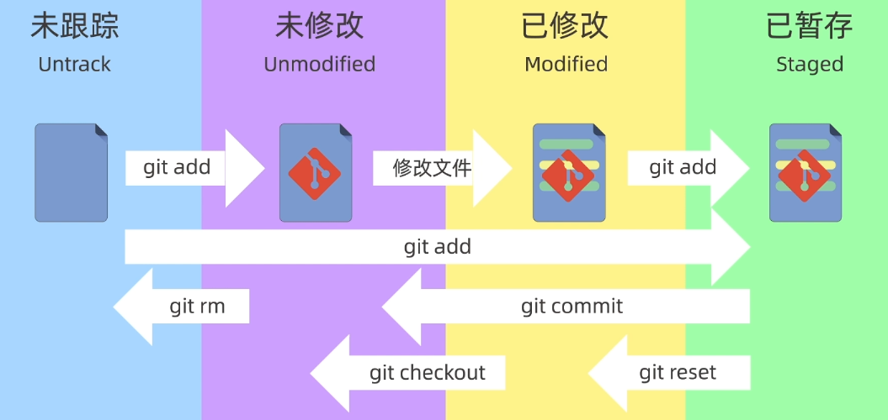
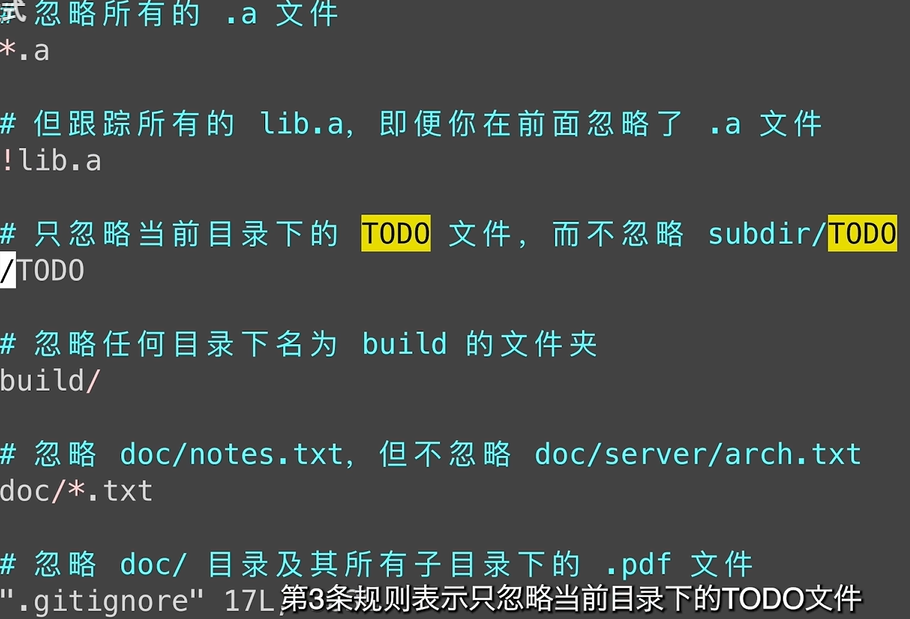

# git 入门

参考视频教程

    https://www.bilibili.com/video/BV1HM411377j?p=1&vd_source=9d800611b62cbf1282fcc9e8602e99a3

## 版本控制系统分类

### 集中式 svn

*   所有文件保存在服务器上，个人电脑只有副本
*   修改文件流程：先从服务器上下载，修改完再提交服务器
*   优点：操作简单
*   缺点：中央服务器出现故障或有网络问题时，所有人都无法工作了

### 分布式git

*   每个人的电脑上都有一个完整的版本库，直接在本地上修改，然后将仓库互相同步

## 本地使用方式

*   GUI
*   IDE扩展
*   命令行：常用方式，下面介绍此方式

### 1. 配置用户名和邮箱

1.  识别是谁提交的代码，只需要在最开始配置一次

        git config --global user.name "sun_yd"

    <!---->

        git config --global user.email 邮箱地址

    1.  \--global全局配置，对所有仓库有效
    2.  \--system：系统配置，对所有用户生效
    3.  省略（Local）：本地配置，只对本地仓库有效

2.  查看配置信息

        git config --global --list

### 2.创建仓库

1.  本地创建仓库

        git init

    1.  linux环境下

            mkdir learn-git //创建一个文件夹

        <!---->

            cd learn-git //转到文件夹目录下

        <!---->

            ls -a //查看当前目录下的所有文件，包括隐藏文件 .git就在里面

        <!---->

            \rm -rf .git //删除.git文件夹

        <!---->

            git init my-repo //新建一个文件夹，并在文件夹里创建git目录

2.  从远程服务器克隆一个已经存在的仓库

        git clone 仓库地址

### 3.工作区域和工作状态

*   工作区域：

1.  工作区： 本地目录，资源管理器看到的目录，相当于生产车间

        git add .  //将要修改的（文件）打包到卡车上（暂存区）

2.  暂存区：索引，保存即将提交到git仓库的修改内容，临时区域，相当于卡车

3.  本地仓库区：通过git init创建的那个仓库，包含了完整的项目历史和元数据，相当于工厂仓库，版本库

*   工作状态：

1.  未跟踪：新创建的，还没有被git管理的文件
2.  未修改：已经被git管理起来，但是内容没有变化
3.  已修改：已经修改过的文件，还没有添加到暂存区里
4.  已暂存：已经修改，并且添加到暂存区的文件

### 4.添加和提交文件

*   查看仓库状态

        git status  //比如当前处在哪个分支，有哪些文件，以及文件处在什么状态

    <!---->

        git ls-files  //查看暂存区的文件

    <!---->

        ls //查看工作区文件，即当前文件夹里的内容

*   Linux创建文件，此时文件status为untrack

        echo "Hello, World!" > file1.txt  //将内容“Hello, World!”输出到file1.txt文件中    >> file1.txt表示追加

    <!---->

        cat file1.text  //查看文件内容

    <!---->

        mv file.txt file4.txt  //修改文件名字为file4.txt

    <!---->

        cp -rf 源文件(夹） 目标文件 （夹）  //复制

*   将文件添加到暂存区，状态为staged

        git add file1.txt  //添加文件file1.txt

    <!---->

        git add .  //表示添加当前目录下所有的文件，包括子目录

    <!---->

        git add *.txt  //表示添加当前目录下所有后缀名为.txt的文件

    *   撤回暂存区的文件，回到工作区

            git rm file1.txt

*   把暂存区的文件提交到本地仓库，不会提交工作区的文件

        git commit -m "第一次提交”

*   查看提交记录

        git log

    <!---->

        git log -oneline  //查看简洁的提交信息

### 5.回退版本

    git reset --soft  版本号     //回退到某一个版本（清空仓库的版本），保留工作区，保留暂存区。回退版本后，修改再提交

<!---->

    git reset --hard  版本号     //回退到某一个版本（清空仓库的版本），丢弃工作区，丢弃暂存区

<!---->

    git reset --mixed(默认）版本号//回退到某一个版本（清空仓库的版本），保留工作区，丢弃暂存区

*   放弃本地修改，用hard模式

*   当连续提交了多个版本，又觉得没什么太大意义，可以回退版本再重新提交，合并成一个版本

    *   soft模式需要重新添加到暂存区git add .
    *   mixed则不需要

### 6.回溯操作

1.      git reflog  //查看历史记录
2.  找到误操作之前的版本号
3.      git reset --hard 版本号 //回退到某个版本

### 7.查看差异

第一行：发生变更的文件

第二行：git会将文件的内容使用哈希算法生成一个40位的哈希值，后面是文件的权限

下面2行表示修改的文件

-表示原来的内容

+表示修改后的内容

    git diff  //默认比较工作区和暂存区的变化

<!---->

    git diff HEAD   //比较工作区+暂存区和版本库的差异，      不确定

<!---->

    git diff --cached  //暂存区和版本库的差异

<!---->

    git diff <commit_hash> <commit_hash>  //比较2个版本之间的差异
    git diff HEAD~ HEAD   //表示当前版本和上个版本的差异     
    HEAD^也可以表示上个版本
    HEAD~2表示前2个版本
    git diff <commit_hash> <commit_hash>  fiel3.txt  //只查看fiel3.txt的差异

<!---->

    git diff <branch_name> <branch_name> //比较分支之间的差异

### 8.从版本库删除文件

1.  直接在工作区删除文件，提交暂存区，再提交到工作区，就删除了

        rm file1.txt  //删除文件

2.  把文件从工作区和暂存区中删除，再提交

    1.      git rm file1.txt  
    2.      git commit -m "名称"

3.      git rm --cached file1.txt  //从暂存区删除文件

4.      git rm -r *  //递归删除某个目录下的所有子目录和文件

### 9..gitignore

*   应该忽略的文件

    *   系统或者软件自动生成的文件
    *   编译生成的中间文件和结果文件
    *   运行过程中生成的日志文件、缓存文件、临时文件
    *   设计身份、密码、口令、密钥等敏感信息文件

*   注意：.gitignore文件生效的前提是 这个文件不能是已经添加到版本库的文件

*   创建编辑文件

        echo "other log" >access.log   //创建日志文件

    <!---->

        echo access.log >.gitignore   //将日志文件添加到.gitignore 文件

    <!---->

        vi .gitignore  //vi编辑文件
        按esc 再 :wq保存文件并退出vi 编辑

*   常用格式<[ .gitignore 模板集合](https://github.com/github/gitignore)>

        *.log   //所有以.log结尾的文件

    <!---->

        temp/   //忽略temp文件夹，空文件夹不会被添加

glob匹配，图片有误

## 远程使用方式

### SSH推送

*   HTTPS：每次提交需要验证账户和密码，已停用

*   SSH配置：推荐方式，提前在GitHub上设置ssh密钥，每次推送不需要验证账户和密码

    1.      cd   //回到根目录

    2.      cd .shh  //跳转到.shh目录

    3.      ssh-keygen -t rsa   //生成ssh文件，协议为rsa,若已有ssh文件，选no

    4.  网上搜索github配置ssh

    5.  多个ssh文件，指定用哪个文件

            # github

        <!---->

            Host github.com

        <!---->

            HostName github.name

        <!---->

            PreferredAuthentications publickey

        <!---->

            IdentityFile ~/.ssh/test

*       git push <remote><branch>   //推送更新内容

*       git pull <remote>  //拉取更新内容

### 关联本地仓库和远程仓库
